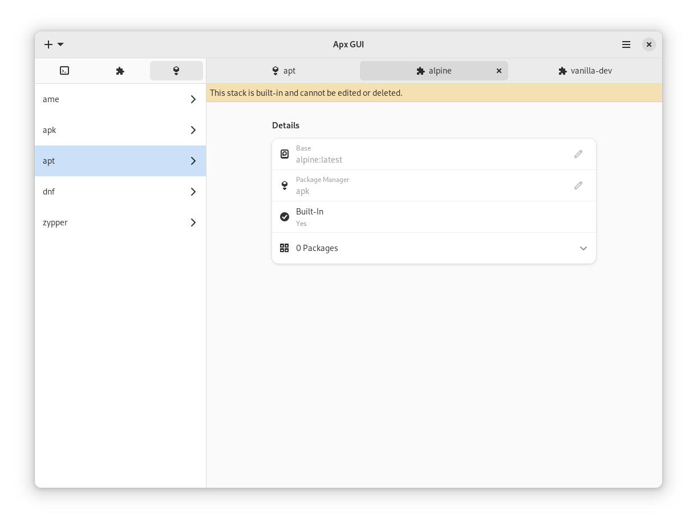

<div align="center">
    
    <h1>Apx IDE</h1>
    <p>A frontend in GTK 4 and Libadwaita for Apx.</p>
    <br />
    
</div>

### Dependencies

- build-essential
- meson
- libadwaita-1-dev
- gettext
- desktop-file-utils
- apx (2.0+)

### Build

```bash
meson setup build
ninja -C build
```

### Install

```bash
sudo ninja -C build install
```

## Run

```bash
apx-ide
```
