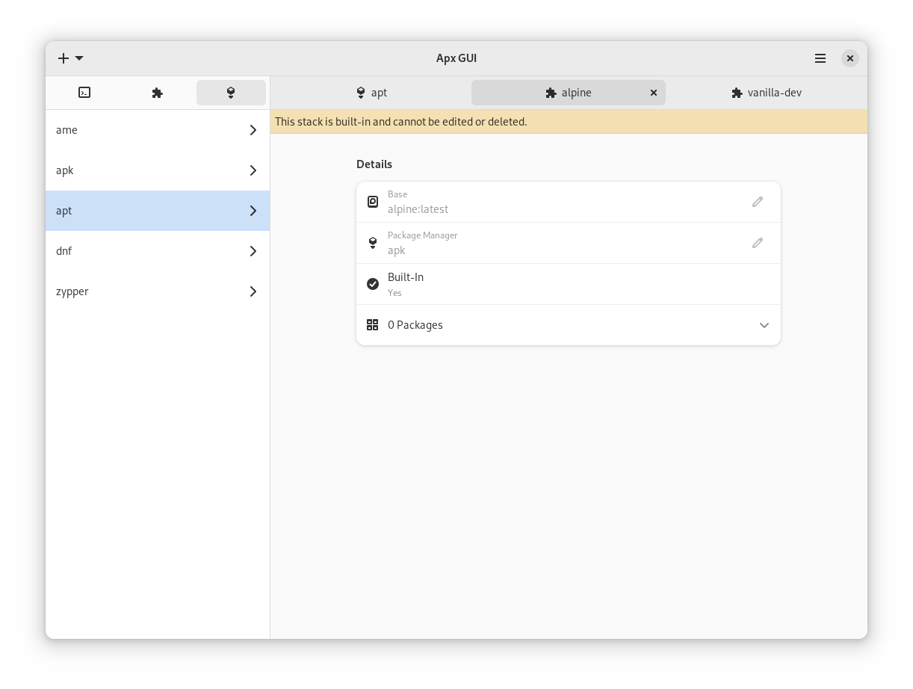

<div align="center">
    
    <h1>Apx GUI</h1>
    <p>A frontend in GTK 4 and Libadwaita for Apx.</p>
    <br />

[![Translation Status][weblate-image]][weblate-url]


</div>

[weblate-url]: <https://hosted.weblate.org/engage/vanilla-os/>
[weblate-image]: <https://hosted.weblate.org/widgets/vanilla-os/-/apx-gui/svg-badge.svg>

### Dependencies

#### Build Dependencies

```bash
apt install -y build-essential meson libadwaita-1-dev \
               desktop-file-utils pkg-config libglib2.0-dev
```

#### Runtime Dependencies

```bash
apt install -y python3 python3-gi \
               gir1.2-gtk-4.0 libadwaita-1-0 \
               gir1.2-vte-3.91 python3-yaml \
               python3-podman gettext
```

**APX version 2.0+ required.**

### Build

```bash
meson setup build
ninja -C build
```

### Install

```bash
sudo ninja -C build install
```

## Run

```bash
apx-gui
```

## Use of Generative AI

Maintainers may use generative AI tools as assistants while working on apx-gui. Non-trivial assisted commits disclose the tool, model, and scope of the work.

AI tools may assist with code comments, documentation, repetitive code, and issue triage. Maintainers make project decisions and review every assisted change before it is merged.

Use these trailers for non-trivial assisted commits:

```plain
Assisted-by: <tool>:<model-version>
AI-Scope: <what the tool generated and the prompt or a short prompt summary>
```

Single-line completions, renames, and formatting changes do not need trailers.

Coding agents must also follow [AGENTS.md](AGENTS.md) before changing files,
creating commits, or opening pull requests.
